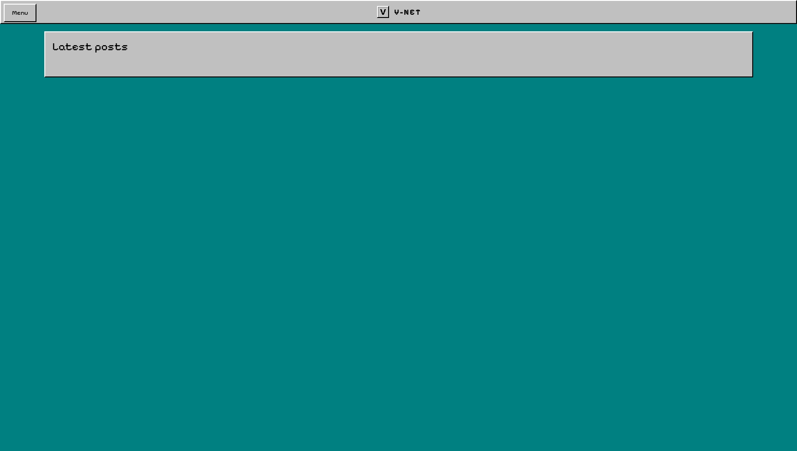
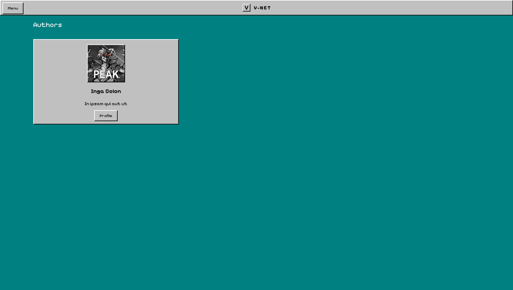

<p align="center">
  
</p>
<h1 align="center">V-Net</h1>

[](https://github.com/yourusername/v-net)
[](https://vuejs.org/)
[](https://www.sanity.io/)
[](https://tailwindcss.com/)
[](https://www.docker.com/)
[](https://opensource.org/licenses/MIT)

V-Net is a retro-themed news application built with Vue.js and Sanity CMS, designed to evoke the nostalgic feel of the Windows 95 era. It combines a classic aesthetic with modern web technologies to deliver a unique news browsing experience.

[//]: # (![V-Net Screenshot]&#40;https://via.placeholder.com/800x400?text=V-Net+Screenshot&#41;)

## Features




- 📱 Responsive design for all devices
- 🔍 Advanced search functionality
- 🔄 Real-time content updates
- 📊 Category-based news filtering

- 🔒 Content management with Sanity CMS
- 🐳 Docker containerization for easy deployment

## Project Structure

- `src/` - Vue.js frontend application
- `vnews-feed/` - Sanity CMS backend for content management

## Prerequisites

- Node.js (v14 or higher)
- npm or yarn
- Docker and Docker Compose (for containerized deployment)

## Getting Started

```bash
# Clone the repository
git clone https://github.com/yourusername/v-net.git
cd v-net

# Install dependencies for frontend
npm install

# Set up environment variables
cp .env.example .env
# Edit .env with your Sanity project details

# Start the development server
npm run serve

# In a separate terminal, set up Sanity CMS
cd v-net-feed
npm install
npm run dev
```

## Development Setup

### Frontend (Vue.js)

```bash
# Install dependencies
npm install

# Serve with hot-reload at localhost:8080
npm run serve

# Build for production
npm run build

# Lint and fix files
npm run lint
```

### Backend (Sanity CMS)

```bash
# Navigate to Sanity project directory
cd v-net-feed

# Install dependencies
npm install

# Start Sanity Studio development server
npm run dev

# Build Sanity Studio
npm run build

# Deploy Sanity Studio
npm run deploy
```

## Docker Deployment

This project includes Docker configuration for easy deployment of both the frontend and backend services.

### Using Docker Compose

```bash
# Build and start all services
docker compose up -d

# View logs
docker compose logs -f

# Stop all services
docker compose down
```

### Individual Docker Builds

#### Frontend (Vue.js)

```bash
# Build the Docker image
docker build -t v-net-frontend .

# Run the container
docker run -p 8080:80 v-net-frontend
```

#### Backend (Sanity CMS)

```bash
# Navigate to Sanity project directory
cd v-net-feed

# Build the Docker image
docker build -t v-net-sanity .

# Run the container
docker run -p 3333:3333 v-net-sanity
```

## Sanity CMS Setup

```bash
# Install Sanity CLI globally
npm install --global sanity@latest

# Login to Sanity
sanity login

# Navigate to Sanity project directory
cd v-net-feed

# Start Sanity Studio
sanity start
```

## Environment Variables

Create a `.env` file in the root directory with the following variables:

```
VUE_APP_SANITY_PROJECT_ID=your-project-id
VUE_APP_SANITY_DATASET=production
VUE_APP_SANITY_API_VERSION=2023-05-03
```

## Contributing

Contributions are welcome! Please feel free to submit a Pull Request.

1. Fork the repository
2. Create your feature branch (`git checkout -b feature/amazing-feature`)
3. Commit your changes (`git commit -m 'Add some amazing feature'`)
4. Push to the branch (`git push origin feature/amazing-feature`)
5. Open a Pull Request

## Support

If you have any questions or need help with setup, please open an issue or contact the maintainers.

## License

[MIT](LICENSE)
